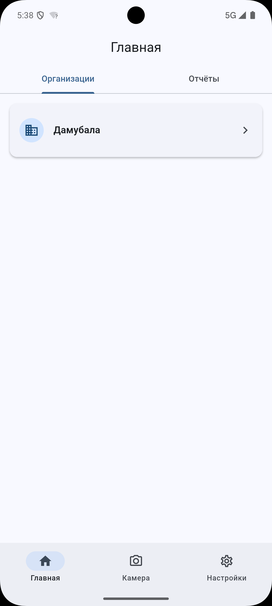
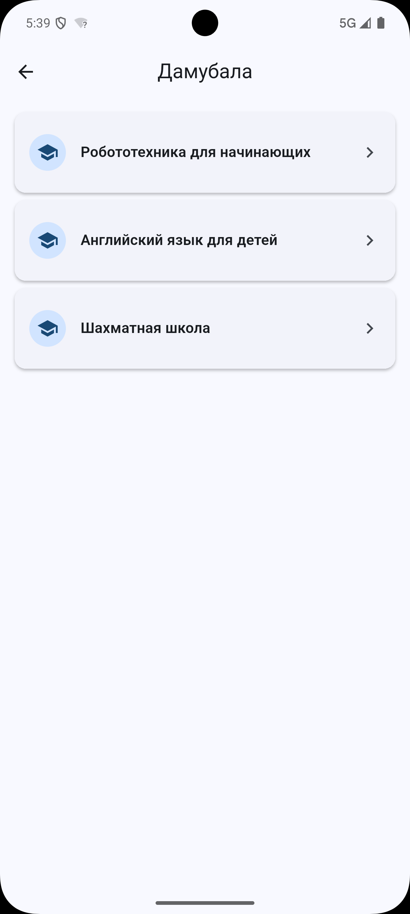
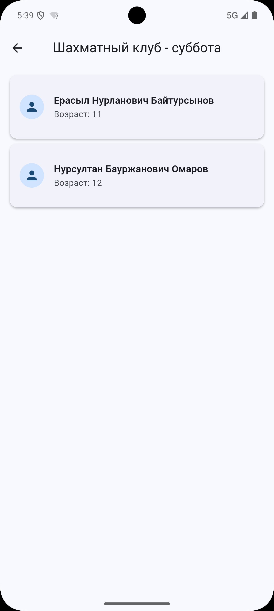
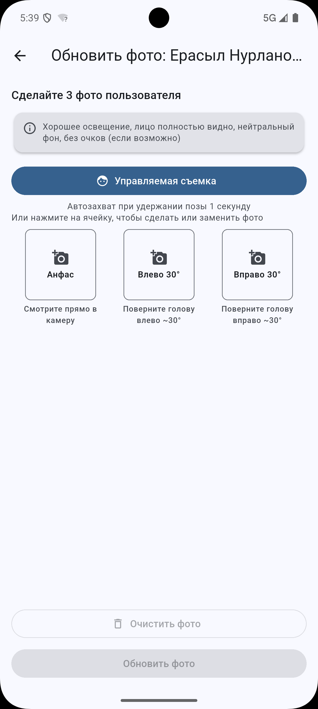
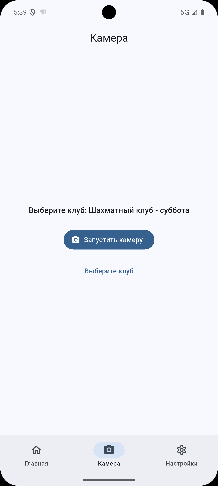
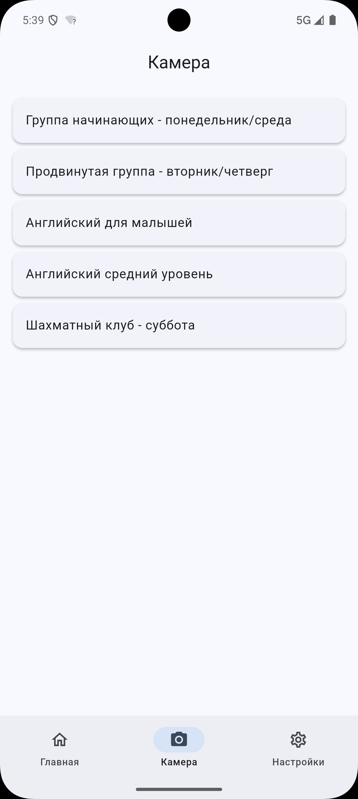
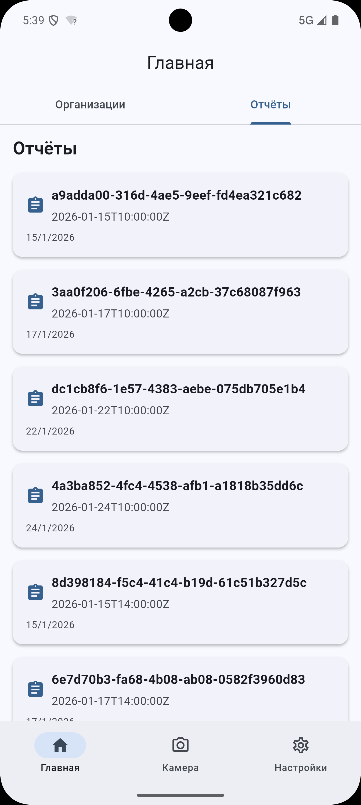
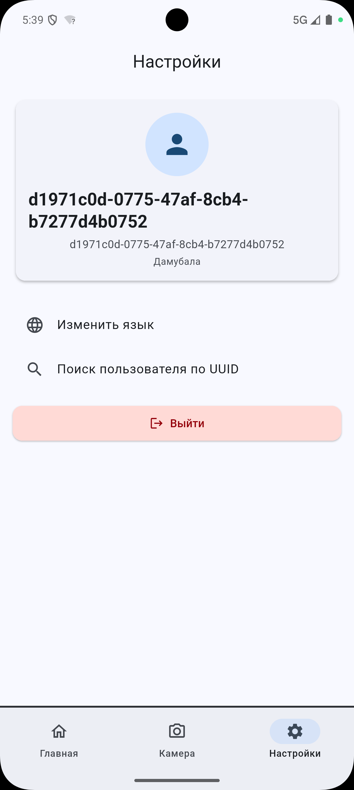

# Kelbet — Attendance Tracker

A cross-platform Flutter app that lets instructors take class attendance with **face recognition**. Built for educational organizations: an instructor logs in, walks down through their organization → course → class, opens the camera, and photographs students one by one. Each photo is matched against enrolled students, and the session ends with a summary of who is present and who is absent.

> Portfolio project. The app talks to two private backends (a REST API and a Dockerized face-recognition service); host URLs are placeholders in this public copy.

## Screenshots

| Organizations | Courses | Students |
|:---:|:---:|:---:|
|  |  |  |
| Home → organizations | Courses in an organization | Students in a class |

| Guided face capture | Camera class list | Attendance summary |
|:---:|:---:|:---:|
|  |  |  |
| 3-pose guided capture (ML Kit) | Pick a class to take attendance | Present / absent summary |

| Visit history | Settings |
|:---:|:---:|
|  |  |
| Attendance records | Profile, language, logout |

## Features

- **Face-recognition attendance** — capture a photo per student, match 1:N against enrolled children, log every recognition result.
- **Guided face capture** — on-device face detection (Google ML Kit) walks the user through three head poses when registering a face.
- **Hierarchical navigation** — organization → course → class → child, backed by a typed REST API.
- **Visit history** — attendance records persist per subscription and are browsable in-app.
- **Auth with refresh** — bearer-token login with automatic, queued token refresh on 401.
- **Internationalization** — full English and Russian localization.
- **Material 3** — light and dark themes.

## Tech stack

| Area | Choice |
|------|--------|
| Framework | Flutter (Dart 3.x, SDK `^3.10.4`) |
| State management | BLoC (`flutter_bloc`) with `Equatable` states |
| Networking | Dio + Retrofit (codegen) |
| On-device ML | Google ML Kit face detection (pose guidance) |
| Local storage | SharedPreferences (tokens, locale) |
| Theming | Material 3 (light / dark) |

## Architecture

The app follows a feature-first layout with a clean separation between transport, API surface, and UI state.

```
lib/
├── main.dart                # entry point: DI wiring, MultiBlocProvider, navigation
├── core/
│   ├── services/            # DioClient, ApiService, FaceRecognitionService, storage
│   ├── models/              # typed data models (JSON-serializable)
│   ├── theme/               # Material 3 themes
│   ├── widgets/             # reusable widgets
│   └── l10n/                # locale management
├── features/
│   ├── auth/                # login screen + AuthBloc
│   ├── attendance/          # home screen (classes + visit histories)
│   ├── camera/              # attendance capture flow (CameraFlowBloc)
│   ├── clubs/               # organization → course → class → child drill-down
│   ├── face_guided_camera/  # guided 3-pose capture via ML Kit
│   ├── face_recognition/    # create/delete face users
│   ├── report_cards/        # visit-history listing
│   └── settings/            # profile, language, single-student recognition
├── l10n/                    # app_en.arb / app_ru.arb
└── generated/l10n/          # generated localizations
```

### Networking layers

- **`DioClient`** — the transport. One Dio instance with an interceptor chain: bearer auth, automatic token refresh (queues concurrent requests during refresh), retry on timeout/5xx, error message extraction, and debug logging that redacts the auth header.
- **`ApiClient`** — a Retrofit interface; endpoint definitions only, generated into `api_client.g.dart`.
- **`ApiService`** — the app-facing API. Typed methods (login, CRUD for classes/children/subscriptions/visit-histories/courses/organizations, recognition logs) that return models and throw on non-success.
- **`FaceRecognitionService`** — talks to the separate face-recognition API (`POST /recognize` and face-user CRUD).

### State management

Each feature owns a BLoC. The most involved is **`CameraFlowBloc`**, a small state machine that orchestrates the multi-step attendance session: club selection → load students → camera → photo review → recognition → summary. On recognition it logs the result; on finish it creates a visit-history record for every recognized student.

## Backends

The app is a client for two services (private; placeholder hosts shown):

| Service | Base URL | Responsibility |
|---------|----------|----------------|
| Main REST API | `http://your-api-host:8080/api/v1` | auth, users, organizations, courses, classes, children, subscriptions, visit histories |
| Face Recognition API | `http://your-api-host:8000` | face registration, recognition (1:N), verification (1:1) |

To run against your own backend, set the base URLs in `lib/core/services/dio_client.dart`, `api_service.dart`, and `face_recognition_service.dart` (and the Android cleartext domain in `android/app/src/main/res/xml/network_security_config.xml`).

## Getting started

```bash
# install dependencies
flutter pub get

# code generation (Retrofit + JSON)
dart run build_runner build

# run
flutter run
```

The face-recognition API is intended to run via Docker:

```bash
docker-compose up -d
```

## Localization

Supported languages: **English** and **Russian**. Strings live in `lib/l10n/app_en.arb` and `lib/l10n/app_ru.arb`.

```bash
# 1. add the key to both .arb files
# 2. regenerate
flutter gen-l10n
```

## Code generation

After changing the Retrofit `ApiClient` or any `@JsonSerializable` model:

```bash
dart run build_runner build
```

## Dependencies

**Runtime:** `flutter_bloc`, `equatable`, `dio`, `retrofit`, `json_annotation` / `json_serializable`, `camera`, `image_picker`, `google_mlkit_face_detection`, `shared_preferences`.

**Dev:** `flutter_lints`, `retrofit_generator`, `build_runner`.
